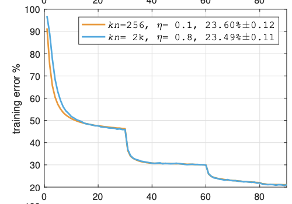

# large_batch_training

## 1 Main Results of training from scratch

### 1.1 Settings and Commands

| setting      | value                                    |
| ------------ | ---------------------------------------- |
| Dataset      | CIFAR10                                  |
| Imagesize    | 32                                       |
| Epochs       | 200                                      |
| Optimizer    | SGD                                      |
| Momentum     | 0.9                                      |
| Lr(initial)  | Scaling learning rate with batch size    |
| Scheduler    | CosineAnnealingLR(with constant warm up) |
| Batch size   | 32,64,128,256,512,1024(checkpoint)       |
| Weight decay | 1e-4                                     |
| Distributed  | Yes                                      |
| Backbone     | MobileNetV2                              |
| strategy     | train full network                       |

code Refer  to https://github.com/timmywanttolearn/finetune

 ### 1.2 Results

| Batchsize(on 4 GPUs) | Initial learning rate(scaled) | val_acc(top1) |
| -------------------- | ----------------------------- | ------------- |
| 32                   | 0.0125                        | 94.32%        |
| 64                   | 0.025                         | 94.32%        |
| 128                  | 0.05                          | 94.27%        |
| 256                  | 0.1                           | 94.28%        |
| 512                  | 0.2                           | 94.16%        |
| 1024(checkpoint)     | 0.4                           | 93.76%        |
| 2048（checkpoint)    | 3.2                           | 92.13%        |

# Reproduce of Accurate, Large Minibatch SGD: Training ImageNet in 1 Hour

## 1 Setting

| setting      | value                                                        |
| ------------ | ------------------------------------------------------------ |
| Dataset      | CIFAR10                                                      |
| Imagesize    | 32                                                           |
| Epochs       | 100                                                          |
| Optimizer    | SGD                                                          |
| Momentum     | 0.9                                                          |
| Lr(initial)  | Scaling learning rate with batch size(0.1 for batch size 256) |
| Scheduler    | CosineAnnealingLR(with gradual warm up and linear scaling rule) |
| Batch size   | 256,1024(checkpoint) ,2048(checkpoint)                                    |
| Weight decay | 1e-4                                                         |
| Distributed  | Yes                                                          |
| warm up      | gradual warm up                                              |
| Backbone     | MobileNetV2                                                  |
| strategy     | train full network                                           |

code Refer  to https://github.com/kuangliu/pytorch-cifar

same settings to paper

## 2 Training error vs mini-batch size

I must confess that due to huge memory costs, I change the dataset to CIFAR10 instead of Imagenet. Also, Resnet is impossible to train batch size 2046(I insert checkpoint at each bottleneck). I change the backbone to MobileNetV2.

presented in paper

My result is here.

You could see that a larger batch get a better result at training sets. Why? The reason is that I use 32*32 pages here, which cost a great overfit on training sets. So I plotted the validation loss% below.

It comes out that smaller batches get better results.

The other picture is about 256 and 2048.

presented in paper

My result is

Similar to the former one.

# finetune acc vs batch size

## 1 Setting

| setting      | value                                                        |
| ------------ | ------------------------------------------------------------ |
| Dataset      | CIFAR10                                                      |
| Imagesize    | 224                                                          |
| Epochs       | 100                                                          |
| Optimizer    | SGD                                                          |
| Momentum     | 0.9                                                          |
| Lr(initial)  | Scaling learning rate with batch size(0.1 for batch size 256) |
| Scheduler    | CosineAnnealingLR(with gradual warm up and linear scaling rule) |
| Batch size   | 32,64,128,256,512(checkpoint)                                |
| Weight decay | 1e-4                                                         |
| Distributed  | Yes                                                          |
| warm up      | gradual warm up                                              |
| Backbone     | MobileNetV2                                                  |
| strategy     | Finetune full network                                        |

## 2 results

| Batchsize(on 4 GPUs) | Initial learning rate(scaled) | val_acc(top1) |
| -------------------- | ----------------------------- | ------------- |
| 32                   | 0.0125                        | 96.30%        |
| 64                   | 0.025                         | 96.37%        |
| 128                  | 0.05                          | 96.11%        |
| 256                  | 0.1                           | 96.01%        |
| 512                  | 0.2                           | 84.16%        |

