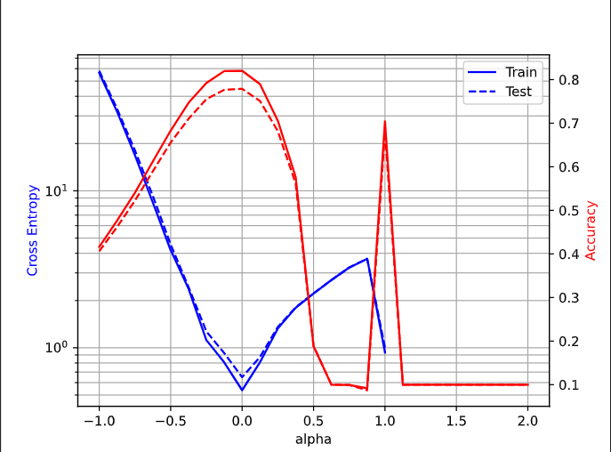

# large_batch_training

## 1 Main Results

### 1.1 Settings and Commands

| setting            | value                                 |
| ------------------ | ------------------------------------- |
| Pretrained dataset | Imagenet                              |
| Dataset            | CIFAR10                               |
| Imagesize          | 32                                    |
| Epochs             | 200                                   |
| Optimizer          | SGD                                   |
| Momentum           | 0.9                                   |
| Lr(initial)        | Scaling learning rate with batch size |
| Scheduler          | CosineAnnealingLR                     |
| Batch size         | 32,64,128,256,512,1024                |
| Weight decay       | 1e-4                                  |
| Distributed        | Yes                                   |
| Backbone           | MobileNetV2                           |
| Finetune strategy  | finetune full network                 |

Refer commands to https://github.com/timmywanttolearn/finetune

 ### 1.2.2 Results

| Batchsize(on 4 GPUs) | Initial learning rate(scaled) | val_acc(top1) |
| -------------------- | ----------------------------- | ------------- |
| 32                   | 3e-4                          | 94.32%        |
| 64                   | 6e-4                          | 94.32%        |
| 128                  | 1.2e-3                        | 94.27%        |
| 256                  | 2.4e-3                        | 94.28%        |
| 512                  | 4.8e-3                        | 94.16%        |
| 1024                 | 9.6e-3                        | 93.76%        |

# Large batch training

I use two architecture to reproduce this paper[1]. One is based on the TensorFlow code that the author provided https://github.com/keskarnitish/large-batch-training. The other is the PyTorch code I wrote. Settings(including backbone, epochs, batch size, learning rate).

For C1, C2 reproduction, I choose tf code provided by author

For vgg11_bn, I use my code.

## 1 Reproduction

In this paper, the author train two sets of parameters. One is using small batches(256), the other uses large batches(5000). And he combines linearly two sets and tests their accuracy and losses on the CIFAR10 dataset.

### 1.1 C1 network

The results show below（C1 network discussed in the paper).

### 

As for my reproduction using the code provided by the author.

40epochs

100 epochs(same in paper)

### 1.2 C2 network

For C2(discussed in the paper)
Results in the paper show below.

My reproduction is（ I trained relatively smaller epochs(about 20))

### 1.3 vgg11_bn

In the Github repo provided PyTorch code training vgg11_bn and get this picture

My result is 

it is wired that if alpha > 1, my model will get negative outputs that are not acceptable......

So I can not draw cross-entropy when alpha > 1.

## 2 Conclusion

It is easily seen that for accuracy curve, sharp minima occur at large batch training, smaller batches have flat minima. However for cross-entropy, due to losses got too huge at alpha > 1, we can not easily see that gap.

# Reference

[1] Keskar N S, Mudigere D, Nocedal J, et al. On large-batch training for deep learning: Generalization gap and sharp minima[J]. arXiv preprint arXiv:1609.04836, 2016.